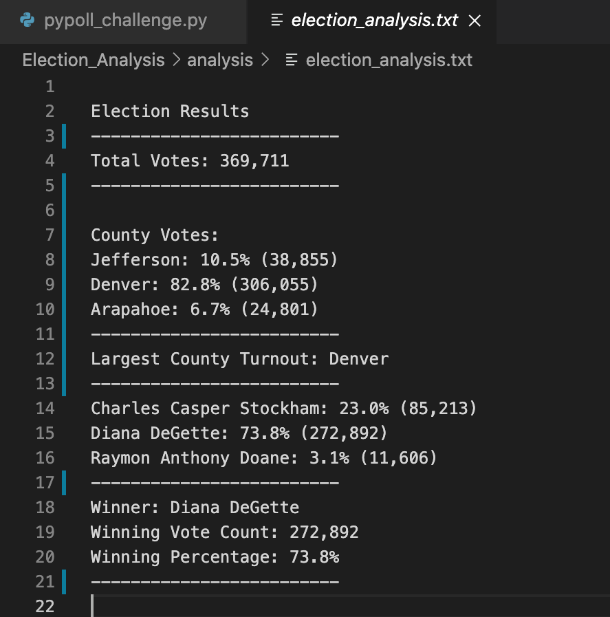

# Election_Analysis
written in python

# Overview of the Project:

In this module we successful helped Seth and Tom create a program that reads and manipulates a large data set and produces the result of an election along with data regarding voter turnout, percentage of votes from each county out of the total amount of votes.  We were asked to create a code and then print the results of the code onto another text file that would be very readable to the average eye. 

- Using for loops, decision statements, dependencies and many other tools; we created a code that would organize the required data very efficiently.
- In the end we were able to print out the results to another text file to make the findings as readable as possible.

## Snapshot of the text file with final results of the election:
1) 
